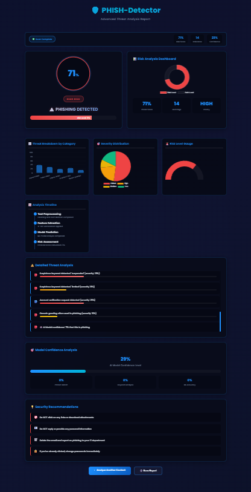
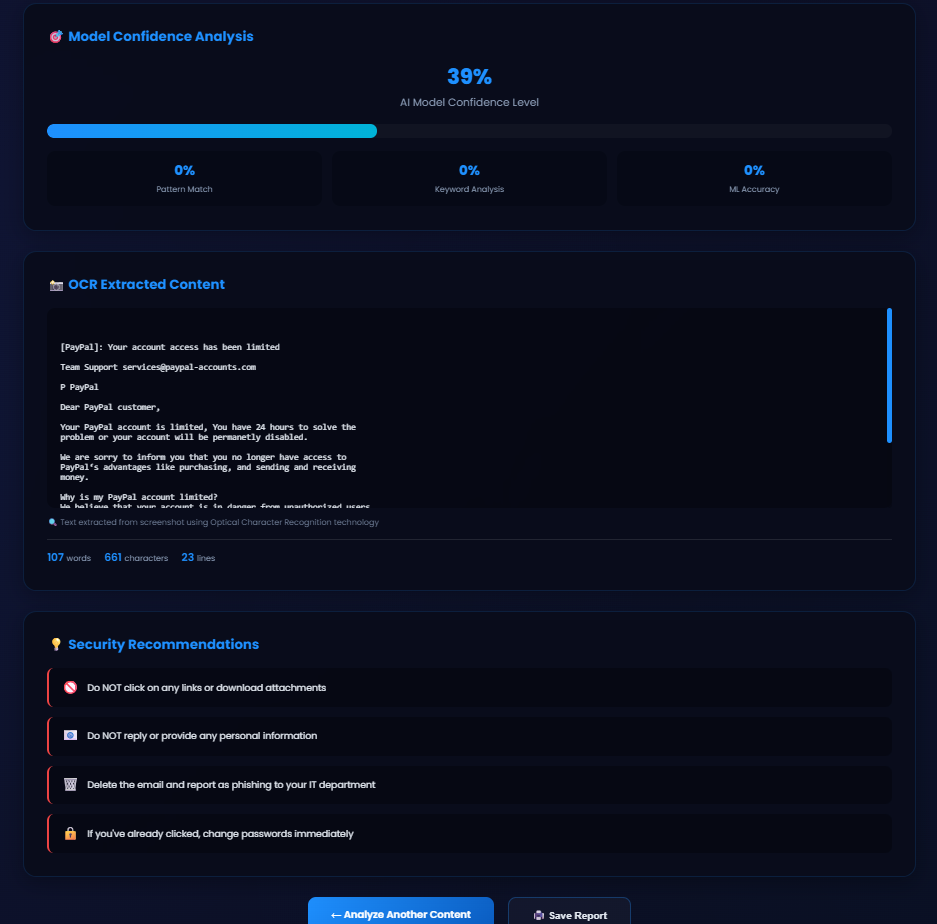

# 🛡️ PHISH-Detector

**AI-powered phishing email detection system** built using Flask, Machine Learning, and OCR technology.


## 📋 Features

- ✅ **Email text analysis** - Real-time phishing detection in emails
- 📸 **Screenshot OCR scanning** - Extract and analyze text from images
- 🎯 **Risk score generation** - 0-100% threat level with visual indicators
- 🔒 **Safe / Phishing prediction** - Clear binary classification results
- 📊 **Interactive visualizations** - Charts and dashboards for threat analysis

## 🛠️ Tech Stack

| Category | Technologies |
|----------|--------------|
| **Backend** | Python, Flask, Scikit-Learn, Pandas, Joblib |
| **Frontend** | HTML5, CSS3, JavaScript, Chart.js |
| **OCR** | Tesseract OCR, Pillow |
| **ML Algorithms** | Logistic Regression, TF-IDF Vectorization |

## 📸 Screenshots

### Home Page


### Phishing Detection Result


### Safe Email Detection


## 🚀 Installation

### Prerequisites
- Python 3.8 or higher
- Tesseract OCR installed on your system

### Steps

```bash
# 1. Install Python dependencies
pip install -r requirements.txt

# 2. Train the machine learning model
python train_model.py

# 3. Run the Flask application
python app1.py

# 4. Open your browser and go to
http://127.0.0.1:5000
